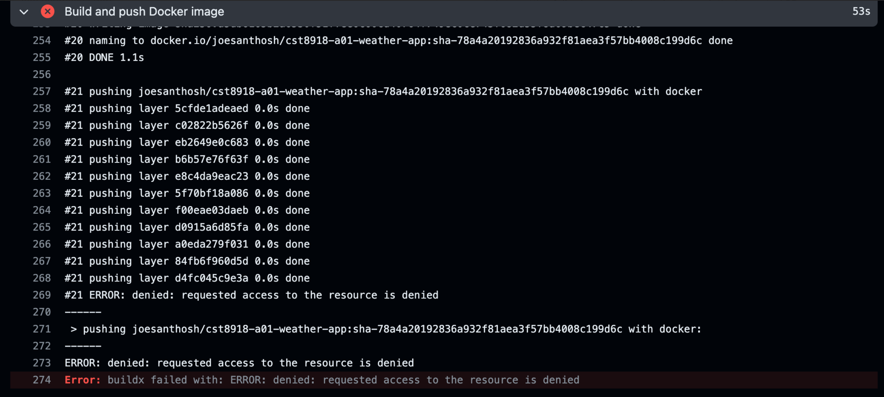
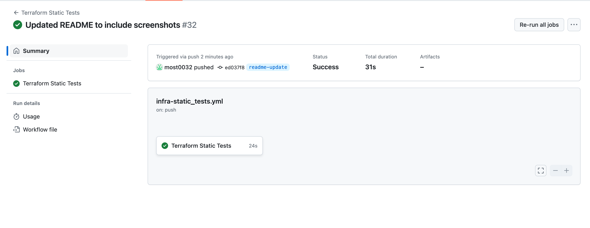

# CST 8918 Final Project Group 1

## Team Members

- Joe Santhosh (Github: https://github.com/joesanthoshalgonquin)
- Muna Adan (Github: https://github.com/Muna0027)
- Nirmal Ghosh Ozhithiparambil Lalappan (Github: https://github.com/nirmal-ghosh)
- Abdelrahman Mostafa (Github: https://github.com/most0032)

## Notes

- The docker push workflow is throwing an error that it isn't able to access the resource. I had AcrPush assignment set but it still wasn't deploying.
  

## Screenshots

- Workflows on Pull request to main
  

- Workflows on Merge changes to main
  

- Static Test Workflow on Push to a branch
  
